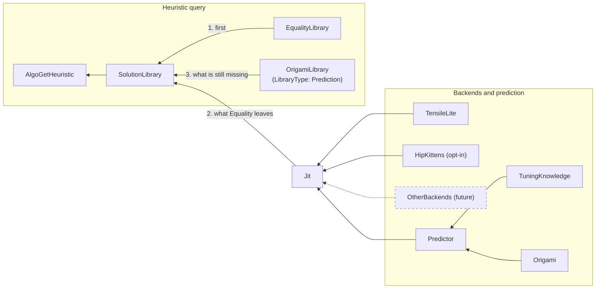

# hipBLASLt JIT target design and roadmap

This page holds the approved plan of record for just-in-time (JIT) GEMM
generation in hipBLASLt and the roadmap that implements it. The
[JIT guide](JIT.md) describes what the code does today, the
[TensileLite backend guide](JIT_TENSILELITE.md) describes the live backend, and
the [HipKittens backend guide](JIT_HIPKITTENS.md) the opt-in one.

- [Target design](#target-design) is the approved plan of record. The seven
  roadmap steps implement it; the work listed after the roadmap remains future.
- [Roadmap](#roadmap) lists the implementation steps, with the status of each.
  "Implemented" means present in the source, not released or approved as
  product naming.

## Target design

This section is the approved plan of record. The [roadmap](#roadmap) tracks
which steps are implemented; until a step is marked Done, its part of the design
is planned only.

Dashed nodes and edges are future backends. Each backend is an independent
generator connected only to Jit; the future backends do not depend on
TensileLite.

### Components

| Component | Role in the target design |
| --- | --- |
| AlgoGetHeuristic | The public entry points `hipblasLtMatmulAlgoGetHeuristic` (C) and `GemmInstance::algoGetHeuristic` (C++ extension). They query SolutionLibrary; no JIT-specific public call is required. |
| SolutionLibrary | The existing Tensile solution-library lookup, fed by the pre-tuned libraries and, when enabled, by the JIT solution library. |
| EqualityLibrary | The existing Equality matching library. |
| OrigamiLibrary | The existing `LibraryType: Prediction` (C++ `ProblemPredictionLibrary`), described under [pre-tuned heuristic selection](JIT.md#pre-tuned-heuristic-selection). The name is a design label, not a new type. |
| Jit | hipBLASLt code that calls a backend-specific JIT interface and builds a library of JIT-generated kernels. In fallback mode it supplies SolutionLibrary after the Equality results and before the other pre-tuned libraries. |
| JIT interface | Input: algorithm parameters (for GEMM: M, N, K, datatypes, scale types, layout, activation and the remaining operation description) plus the gfx target. Output: solutions. Each backend implements it. |
| TensileLite backend | The live backend. It emits assembly, HIP helper source and metadata. See the [TensileLite backend guide](JIT_TENSILELITE.md). |
| HipKittens, other backends | Extension points behind the same interface. The HipKittens backend instantiates kernels at run time through comgr, is opt-in and is available in developer builds only. It serves gfx950 BF16 and FP16 TN GEMM kernels through the internal entry points, and heuristic queries when `HIPBLASLT_JIT_BACKENDS` names it (see the [HipKittens backend guide](JIT_HIPKITTENS.md)). |
| Mock backend | A new in-process test backend behind the same interface. It proves the interface is swappable and that Jit does not depend on TensileLite. |
| Predictor | Ranks candidate configurations for Jit. It is fed by Origami and TuningKnowledge. |
| Origami | The existing analytical model. It ranks configurations; it is not a generator backend. |
| TuningKnowledge | A new interface that supplies the seeds the Predictor ranks, including values for knobs the model does not predict. The TensileLite backend's knowledge supplies tuned sets from a database built from the shipped logic files, then the catalog's tile shapes; see [predictor and TuningKnowledge](JIT.md#predictor-and-tuningknowledge). |
| Code-object builder | hipBLASLt C++ that turns emitted source into executable code objects through AMD comgr. |
| JIT solution library | The persistent cache of generated solutions, loaded as a second master library. |

### Jit and the backend interface

Jit is the component name; the design does not introduce a `JitInterface`
type name. Jit passes the algorithm parameters and gfx target to the selected
backend and receives solutions back. Backend implementations are backend
specific and independent of one another: TensileLite is live, HipKittens serves
the internal entry points and, when `HIPBLASLT_JIT_BACKENDS` names it, heuristic
queries; other generators can implement the same interface. A new in-process mock backend in the tests demonstrates that Jit
does not depend on TensileLite.

Backends generate code at run time. Prebuilt or handwritten assembly kernels are
served through the existing KFA custom-kernel path (GFA in TensileLite, see
[CustomKernels/README.md](tensilelite/Tensile/CustomKernels/README.md)) in the
pre-tuned library, not through the JIT.

The existing type-reuse guidance still applies. The GEMM payload remains
`RocblasltContractionProblem`, another generator does not require a second
public GEMM problem model, and selection and execution reuse
`ContractionProblemGemm`, `ContractionSolution`, `KernelArguments`,
`KernelInvocation` and the HIP `SolutionAdapter` where sufficient. The
[KFA assessment](jit-design/kfa-producer-convergence.md) records which metadata
generators must carry for a shared consumer.

### Predictor and TuningKnowledge

The Predictor produces ranked candidates for Jit. Its inputs are Origami and
TuningKnowledge. The C++ Origami predictor behind the Predictor interface
(`hipblaslt-jit-origami-predictor.cpp`) ranks synthetic candidates with Origami
and emits the `origami.gemm.dp.v1` and `origami.gemm.persistent.v1` modeled
contracts. The TensileLite backend's TuningKnowledge reads a knowledge file
built from the shipped logic files and supplies the nearest tuned sets first,
each as a `tensilelite.tuned.v1` candidate that keeps its tuned split-K and
execution policy. The catalog's seeds follow, and on gfx942, gfx950 and gfx1250
Origami ranks them as data-parallel and Hybrid Stream-K candidates; see
[predictor and TuningKnowledge](JIT.md#predictor-and-tuningknowledge).
Calibration and native gfx942 and gfx1250 measurement remain
[future work](#roadmap).

### Code-object construction with comgr

Roadmap step 3 implements this as
[code-object construction with comgr](JIT.md#code-object-construction-with-comgr)
describes.

### JIT solution library

The JIT solution library is the persistent cache. Roadmap step 4 implements it
as described under [persistent solution library](JIT.md#persistent-solution-library):

- **Location:** the directory named by `HIPBLASLT_JIT_LIBRARY_PATH`. By default
  hipBLASLt creates a per-user directory with mode 0700:
  `/tmp/hipblaslt-jit-<uid>/` on Linux and `%TEMP%\hipblaslt-jit-<user>` on
  Windows.
- **Layout:** one standard lazy TensileLite library per cache key, a master
  file plus one entry and code object per solution, matched by exact
  `ProblemType` and sizes.
- **Publication:** new solutions merge into the library under a file lock and
  are published by atomic rename, so several processes can share a directory.
- **Loading:** the runtime loads it as a second master library alongside the
  pre-tuned libraries.
- **Indices:** cached solutions use real solution indices from a reserved index
  range. Tests may continue to use process-local JIT tokens.
- **Cache key:** each library records the gfx target and its target features,
  the backend identifier and version, the comgr version, the code-object
  version, the ROCm path that the builder passes to comgr, the compiler
  environment settings that affect output, and the library schema version. A
  library whose key does not match the running process is ignored. hipBLASLt
  never deletes cache entries automatically.

Process-local algorithm retention is a separate mechanism.

### Tool paths

Generation needs the Python interpreter, the TensileLite source directory and
its import paths, and the compiler that TensileLite uses to probe assembler
capabilities. A heuristic query has no application `Options`, so their
locations are build-time defaults compiled into the library, and the
`HIPBLASLT_JIT_PYTHON`, `HIPBLASLT_JIT_TENSILE_SOURCE`,
`HIPBLASLT_JIT_PYTHONPATH` and `HIPBLASLT_JIT_CXX` environment variables
override them. Step 5 implements this; see
[tool paths](JIT_TENSILELITE.md#tool-paths).

### Heuristic integration and `HIPBLASLT_JIT`

| `HIPBLASLT_JIT` | Behavior |
| --- | --- |
| `0` or unset (default) | JIT is off. Heuristic queries and `hipblasLtMatmul` behave as in a build without JIT. |
| `1` | Fallback. JIT is a source after the Equality results and before the other pre-tuned libraries. |
| `2` | Forced. JIT is the only source: the query skips the override file, Equality, Origami (Prediction), all other pre-tuned libraries, every other hipBLASLt source and the `getAllSolutions` fill. It looks up the JIT solution library first, then generates. |

In fallback mode, each source supplies only what is still missing from
`requestedAlgoCount`, in this order:

1. The override file and the Equality rows of the pre-tuned libraries.
2. The JIT solution library for the problem's `ProblemType` and sizes.
3. Generation: Jit asks the backend for as many new solutions as are needed to
   reach `requestedAlgoCount`, builds their code objects, publishes them into
   the JIT solution library and returns them.
4. The other pre-tuned libraries (Range, Origami (Prediction), GridBased,
   FreeSize and MLP), then the existing `getAllSolutions` shortfall fill.

The retry that repeats an xf32 lookup with FP32 math covers both pre-tuned
steps and does not generate again. When another hipBLASLt route answers the
problem before the Tensile lookup, its results come first, followed by the
`getAllSolutions` fill, and JIT supplies only what is still missing.

This mirrors `AlgoGetHeuristic`, which already returns up to the requested count.
JIT solutions therefore can complete a partial result, not only an empty one.

Failures follow these rules:

- JIT failures are always reported, in both modes.
- In fallback mode, a result shorter than `requestedAlgoCount` is not an error:
  the existing heuristic contract already returns fewer results with success,
  so the query returns what it found and reports the shortfall.
- In forced mode, a failure returns zero results and is still reported.

`hipblasLtMatmul` without an algorithm follows the mode: in fallback mode it
runs the first solution of the same order, so an Equality result wins, then a
JIT solution, then the other pre-tuned libraries, and in forced mode it uses
only JIT. A build with `HIPBLASLT_ENABLE_JIT=OFF` ignores `HIPBLASLT_JIT` and
prints a one-time warning when it is set. Step 5 implements this section; see
[heuristic integration](JIT.md#heuristic-integration).

### Public API changes

The explicit JIT entry points are not part of the public API; roadmap step 1,
which is Done, implements this part of the design:

- `getJitAlgo`, `getLibraryAlgos`, `makeGemmRequest`, both `getGemmAlgo`
  functions (generic and TensileLite direct) and both `createBackend` functions
  (TensileLite and mock) are not in the public or extension API.
- `hipblaslt-jit.hpp`, `hipblaslt-jit-tensilelite.hpp`, `hipblaslt-jit-mock.hpp`
  and `hipblaslt-jit-gemm-internal.hpp` are not installed or included from
  `hipblaslt-ext.hpp`. They are internal headers under `library/src/amd_detail/`
  used by the JIT tests. The functions and the `GemmRequest` type stay exported
  from the shared library only so those tests can link; see
  [Entry points](JIT.md#entry-points).
- The `hipblaslt-jit-direct-gemm-test` and `hipblaslt-jit-generic-gemm-test`
  binaries under `clients/tests/jit` exercise the two entry points and are run
  by `.github/scripts/test_hipblaslt_jit.py`.
- Step 5 removed `hipblaslt-bench --jit-gemm`. The benchmark reaches JIT
  through `HIPBLASLT_JIT` like any other application.

Applications reach JIT only through the heuristic query and `HIPBLASLT_JIT`.

## Roadmap

The steps are planned in this order, and the status column shows which are
implemented. The work-area column names the part of the overall JIT effort that
each step advances.

| Step | Status | Scope | Work area |
| --- | --- | --- | --- |
| 1. Demote the public API | Done | `hipblaslt-jit.hpp` and `hipblaslt-jit-tensilelite.hpp` are not installed and `hipblaslt-ext.hpp` does not include them; they are internal headers used by unit tests. The direct and generic GEMM test binaries under `clients/tests/jit` are run by the shared driver. `hipblaslt-bench --jit-gemm` used the internal header until step 5 removed it. | Backend interface |
| 2. Jit component and interfaces | Done | Add Jit, the backend interface, the mock backend, and the Predictor and TuningKnowledge interfaces. Wrap the existing TensileLite provider and C++ predictor behind them. | Backend interface; prediction; tuning knowledge |
| 3. comgr code-object builder | Done | hipBLASLt builds one code object per solution through comgr, linking the main kernel assembly and the helper HIP source together. With `--source-only`, TensileLite emits only assembly, helper source and metadata, and `Tensile.JitGemm` can publish several ranked bundles. comgr's own cache keeps its default. | Backend interface |
| 4. JIT solution library | Done | One standard lazy TensileLite library per cache key under `HIPBLASLT_JIT_LIBRARY_PATH` or a private per-user default, with exact-size entries merged under a file lock by atomic rename, loaded as a second master library that reloads when other processes publish, with reserved solution indices from 2^30 to `INT32_MAX`. `jit::getLibraryAlgos` looks solutions up and publishes them; step 5 connects the heuristic queries to it. | JIT solution library (cache) |
| 5. Heuristic integration | Done | `HIPBLASLT_JIT` modes 0, 1 and 2 in `hipblasLtMatmulAlgoGetHeuristic`, `GemmInstance::algoGetHeuristic` and `hipblasLtMatmul` without an algorithm, with the fallback order and failure rules above and every JIT failure reported on stderr. The tool-path defaults are compiled into the library, a JIT-off build warns once when it sees `HIPBLASLT_JIT`, and `hipblaslt-bench --jit-gemm` is removed. The shared driver checks each mode, reuse of the library by a second process, failure reports and the JIT-off warning. | JustInTime library type; backend interface |
| 6. Validation sweep | Done | The shared driver's heuristic routes cover each mode, a published index resolved with JIT off, distinct kernels when several solutions are requested, the order of a device library's Equality results, JIT solutions and other pre-tuned results, a problem the backend cannot rank, and threads and processes that query the same problem at once. The gfx1250 routes generate ranked heuristic solutions and build their code objects without a gfx1250 device. | Overall JIT validation |
| 7. Timing and progress diagnostics | Done | `HIPBLASLT_JIT_DEBUG` categories `timing` and `progress`, or `all`, print JSON lines on stderr or to `HIPBLASLT_JIT_DEBUG_FILE` for heuristic queries, `hipblasLtMatmul`, generations and their solutions, with the generator's own stages and events relayed through `--debug` and `--debug-dir`. Unset, empty or with JIT off it adds no lines, files, generator arguments or clock reads. The shared driver's debug routes, `hipblaslt-jit-debug-test` and `hipblaslt-jit-debug-child-test` check it. | Overall JIT validation |

The following work sits outside the seven steps and remains future:

| Work | Remaining contract |
| --- | --- |
| Activation specialization | Generated kernels already compile the requested bias (presence, type and source), aux output, scale vectors, amax and gate residual exactly. Only the activation stays generic: each kernel carries every activation kind and selects the requested one at run time. Compiling only the requested kind remains future work; it measured a gain of 0.7% or less on gfx950. This is separate from modeling epilogue cost. |
| Tuning knowledge | The TensileLite backend's TuningKnowledge supplies tuned seeds from a database built from the shipped logic files, and the catalog's Hybrid Stream-K candidates under the `origami.gemm.persistent.v1` contract (see [predictor and TuningKnowledge](JIT.md#predictor-and-tuningknowledge)). Calibrating Origami's estimates, which on gfx1250 combine provisional gfx950 memory values with gfx1250 overrides, and measuring the tuned seeds and Stream-K candidates on native gfx942 and gfx1250 devices, where their test routes are compile-only, remain future. |
| HipKittens and other backends | Implement the backend interface. The [HipKittens backend](JIT_HIPKITTENS.md) serves gfx950 BF16 and FP16 TN GEMM kernels with alpha, beta·C, strided batches and any leading dimensions, through the internal entry points, and heuristic queries after or before TensileLite when `HIPBLASLT_JIT_BACKENDS` names it. Tails (partial tiles) stay unsupported because TensileLite serves those sizes. gfx1250, FP8 and MXFP8, and other backends remain future. |
| KFA metadata convergence | Complete the KFA metadata that JIT generators emit, then prove argument, launch, helper, workspace and synchronization equivalence before generated kernels share the custom-kernel dispatch path. This reuses the KFA path; it does not make the JIT load prebuilt kernels. See the [KFA assessment](jit-design/kfa-producer-convergence.md). |
| More operations | Add concrete profiles and adapters after demonstrating their execution contracts. Non-GEMM KFA support, a stable external plugin ABI and dynamic backend discovery remain undefined. |
