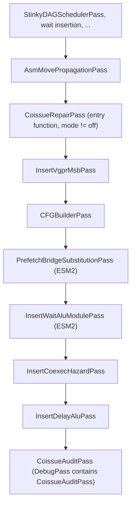

# Co-issue Repair Pass

## Status

This document describes the current implementation. The pass is off by default
(`CoissueRepairMode = "off"`); with it off, the generated code is byte-identical
to a build without the pass.

`CoissueRepairPass` reorders the scalar and vector fillers of each innermost loop
that has matrix ops, so that what the passes after it insert (bank switches,
`s_wait_alu`, `v_nop`, the prefetch bridge) costs less matrix-pipe time. It runs
on gfx1250 only.

## The Problem

A `v_wmma` occupies the matrix pipe for several cycles. While it runs, the wave
issues the other instructions of the loop; on gfx1250 a VALU can co-issue only on
certain cycles of the window (the matrix op's `coIssueWindow`). The scheduler
fills each window with SALU and VALU work so that the next `v_wmma` issues as soon
as the pipe is free.

The scheduler plans an order without the instructions the later passes add:
`InsertVgprMsbPass` puts `s_set_vgpr_msb` in front of instructions that change
VGPR bank, `InsertWaitAluPass` puts `s_wait_alu` in front of instructions that
read a VALU result too early, `InsertCoexecHazardPass` adds `v_nop`, and the
memory waits cost issue cycles of their own. Each of these takes a cycle the plan
gave to a filler. A window that was full now overflows, the next `v_wmma` issues
late, and the matrix pipe goes idle:

```text
  plan (cycle: instruction)         final code
  0: v_wmma                         0: v_wmma
  1: s_add   2: s_cmp               1: s_add   2: s_cmp
  3: v_add (VALU slot)              3: s_set_vgpr_msb   <- takes the VALU slot
  ...                               6: v_add            <- waits for the next slot
  8: v_wmma                         9: v_wmma           <- one cycle late
```

The repair pass predicts the final code of each candidate order, times it, and
moves fillers between windows (or within one) when every timing profile agrees
that the matrix pipe gets less idle.

## Pipeline Position



`Gfx1250Backend` adds the pass when the scheduler runs and
`CoissueRepairMode` is not `off`. By then every pass that changes the shape of
the loops has run and the memory waits are final; what follows are exactly the
passes the repair predicts. With the repair on, the backend skips
`WaitAwareScheduleRepairPass`: both reorder the same windows.

## How It Works

For each innermost loop with matrix ops (`LoopScope`), in this order:

1. **Predict.** `InsertionPipeline` runs one model per later pass on a candidate
   order and returns the loop as those passes will leave it.
2. **Time.** `IssueTimeline` replays the predicted loop under each timing
   profile, for two trips; the second trip is the steady state.
3. **Find damage.** `DamageReport` compares the final timing with the
   scheduler's plan, window by window.
4. **Propose moves.** Rules propose single-instruction moves for the damaged
   windows, worst first.
5. **Check and accept.** `MoveChecker` refuses illegal moves; a legal move is
   kept if no profile gets worse and the sum gets better, and the later passes
   insert no more than before.
6. **Decide.** After the last accepted move, the policy decides whether the new
   order is written back.

### Insertion models

| Model | Pass it predicts | Shared code |
|---|---|---|
| `VgprMsb` | `InsertVgprMsbPass` | `planVgprMsb` (`VgprMsbPlanner.hpp`) |
| `PrefetchBridge` | `PrefetchBridgeSubstitutionPass` | `planPrefetchBridge` (`PrefetchBridgePlanner.hpp`) |
| `WaitAlu` | `InsertWaitAluPass` | `WaitAluTracker` (`InsertWaitAluPass.hpp`) |
| `CoexecNop` | `InsertCoexecHazardPass` | `planCoexecNops` (`CoexecNopPlanner.hpp`) |

Each pass emits from the same planner its model calls, so the two cannot drift
apart. `InsertionModelTest` runs each model and its pass on the pass's filecheck
inputs and requires identical instruction sequences.

The `WaitAlu` model starts each loop block from the state the blocks outside the
loop hand it: it runs the pass's phase 1 (the worklist over the whole function,
in the pass's block order) once, with the prefetches the bridge pass rewrites.
Without that, a VMEM read or a VALU result still in flight at the loop entry goes
unseen.

The models reuse work where a move cannot change their answer (a moved scalar
leaves the coexec plan alone, a moved non-event leaves the bridge plan alone, an
order whose wait-relevant instructions keep their order keeps its waits). The
search screens candidates with the current order's `s_wait_alu` (`Fidelity::Screen`)
and confirms the survivors exactly (`Fidelity::Exact`).

### Timing profiles

A `TimingProfile` is one set of timing facts. It is resolved in three layers:

1. **HwInstDesc facts:** each matrix op's issue cycles and `coIssueWindow`, each
   instruction's latency.
2. **HWModel facts** (`HWModel::issue`, `matrixQueue`, `latencyRules`,
   `calibratedMatrixForms`): measured per arch. They are facts, not policy.
3. **Knobs:** a knob that is set (`>= 0`, or a non-empty spec) overrides the fact;
   knob cost and latency rules go in front of the HWModel's, so the first match wins.

The gfx1250 facts, measured on one scale-FP8 loop (`mxf8_tn_maf`) with rocprofv3
counters and ATT traces:

| Fact | Value |
|---|---|
| issue cycles after a `v_wmma` | 2 |
| a blocked co-issue cycle (`blockedScaleMask`) also blocks other instructions | no |
| satisfied memory wait | 1 issue + 2 settle (no settle right behind another wait) |
| `s_wait_alu` | 3 |
| `s_set_vgpr_msb` after a matrix op, SALU or VALU | 0 |
| `s_set_vgpr_msb` after an LDS load | 3 |
| `s_set_vgpr_msb` after another switch, or anything else | 1 |
| SALU to branch through SCC (`s_cmp` then `s_cbranch_scc*`) | 9 |
| SALU to dependent SALU | 1 |
| matrix-op queue | 3 deep |
| calibrated form | `v_wmma_scale_f32_16x16x128_f8f6f4`, FP8 operands |

The presets are:

- `compiler`: the cost model the scheduler uses (`CDNA5ReadyQueue`): HwInstDesc
  facts only, no queue, no context-dependent costs. `schedulerProfile` adds the
  scheduler's two quirks and is used to check that the timeline reproduces the
  scheduler's clock (`SchedulerPresetMatchesCdna5Clock`).
- `measured`: the HWModel facts, with the conservative sync model (a barrier wait
  empties the queue).
- `measured-queue2`, `measured-queue4`, `measured-flat-waits`: `measured` with the
  one fact it questions changed: queue depth 2 or 4, or every wait 3 cycles flat.

`CoissueProfileSet = "robust"` evaluates all five, with `measured` as the
primary profile (it drives the damage report, the margin and the calibrated
scope). A set can also be a `+`-separated list, e.g. `"compiler+measured"`.

The cost of an order under one profile is a `TripCost`: the matrix-pipe idle of
the steady trip (including the hand-over from the previous trip), then the trip
length as a tie-break.

### Damage and rules

A window is damaged when the predicted final code makes its matrix op issue later
than the scheduler planned (`extraIssue`), or when a VALU planned in it lost its
slot (it sits later in its window, or in a later window). Severity is the issue
growth clamped at zero plus the lost slots; the worst windows are tried first.

Core rules (`RepairRules.cpp`), tried first:

- **MakeRoom:** move a filler of a damaged window to the start or end of a window
  up to `CoissueSearchRadius` windows away.
- **ClearSlot:** move a VALU that lost its slot to the start or end of its own
  window (or, within the radius, of another one).

Patterns (`RepairPatterns.cpp`), the extensions, tried after the core rules for
each window; each one applies only when its profile makes the shape cost
something:

- **hoist-compare:** a compare right in front of an SCC branch moves into an
  earlier window that has lead (its matrix op waits in the queue), so the 9-cycle
  SCC latency overlaps matrix work.
- **switch-after-load:** a low-bank VALU right behind a high-bank LDS load needs a
  bank switch, which costs 3 cycles behind the load and none behind a SALU: a SALU
  of the window goes in between, or the VALU goes in front of the loads.

### Legality

`MoveChecker` moves only SALU and VALU fillers that are not pinned; branches,
barriers, calls, instructions with side effects, exec-mask groups and EXEC writers
never move. It refuses a move that crosses a label, a branch, a barrier or a call;
that leaves its block or its slot among the block's non-instruction IR nodes; that
crosses a register dependence of the block's `buildRegisterDependencyDAG` (SCC
included); or, for a filler touching a register a memory op of the loop writes,
that crosses a memory wait. An instruction with a predicted `s_wait_alu` in front
is pinned: the wait stays in front of what it guards. `MoveCheckerTest` covers
each refusal.

### Acceptance

The search is first-improvement, as in the prototype: the first candidate that
passes is kept, the report is rebuilt, and the search starts again from the worst
window, until no candidate passes or `CoissueMaxMoves` moves are made. A
candidate passes when:

- **robust:** its cost is no worse than the best under every profile, and the
  sum over the profiles is strictly lower;
- **limits:** the later passes insert no more `s_set_vgpr_msb`, `s_wait_alu` or
  nops than for the current order.

### Write-back policy

`RepairPolicy` decides, in this order:

| Reason | When |
|---|---|
| `off` | `CoissueRepairMode = "off"` (the backend does not add the pass then) |
| `matrix ops not calibrated` | apply mode, a matrix form outside the calibrated scope, no trust: the loop is not even searched |
| `nothing to do` | no move passed |
| `below the X% margin` | the worst gain over the profiles is less than `CoissueMarginPercent` of the primary profile's trip |
| `matrix ops not calibrated` | shadow mode, outside the calibrated scope and no trust |
| `would apply (shadow mode)` | shadow mode: report only |
| `apply` | the new order is written back |

The calibrated scope is the primary profile's list of measured matrix forms
(opcode, and whether an operand is FP4). `CoissueTrustUncalibrated` lifts it.

## Knobs

| Tensile global parameter | Module option | Default | Meaning |
|---|---|---|---|
| `StinkyTofuCoissueRepairMode` | `CoissueRepairMode` | `"off"` | `off`, `shadow` (search and report) or `apply` |
| `StinkyTofuCoissueMarginPercent` | `CoissueMarginPercent` | `0.5` | worst-case gain needed to write back, % of the loop's trip |
| `StinkyTofuCoissueProfileSet` | `CoissueProfileSet` | `"robust"` | `robust`, or `+`-separated profile names |
| `StinkyTofuCoissueMaxMoves` | `CoissueMaxMoves` | `64` | moves per loop |
| `StinkyTofuCoissueSearchRadius` | `CoissueSearchRadius` | `4` | windows a move may travel |
| `StinkyTofuCoissueTrustUncalibrated` | `CoissueTrustUncalibrated` | `False` | write back loops outside the calibrated scope |
| `StinkyTofuCoissuePatterns` | `CoissuePatterns` | `""` | comma-separated patterns, `""` = all, `none` = no pattern |
| `StinkyTofuCoissueWaitcntIssueCycles` | `CoissueWaitcntIssueCycles` | `-1` | issue cycles of a satisfied memory wait (-1 = HWModel fact) |
| `StinkyTofuCoissueWaitcntSettleCycles` | `CoissueWaitcntSettleCycles` | `-1` | settle cycles after it |
| `StinkyTofuCoissueIssueCycles` | `CoissueIssueCycles` | `""` | cost rules, `<inst>[@<after>]=<n>`, e.g. `"s_wait_tensorcnt=4; s_set_vgpr_msb@lds=3"` |
| `StinkyTofuCoissueScalarLatency` | `CoissueScalarLatency` | `""` | latency rules, `<producer>><consumer>[:<reg>]=<n>`, e.g. `"salu>branch:scc=9"` |
| `StinkyTofuCoissueMatrixQueueDepth` | `CoissueMatrixQueueDepth` | `-1` | matrix-op queue depth (-1 = HWModel fact, 0 = no queue) |

In a rule, `<inst>` and `<after>` are a mnemonic or a class: `any` (`*`),
`matrix`, `valu`, `salu`, `branch`, `lds` (`ds_load`), `lds_store` (`ds_store`),
`memory`, `wait`, `barrier`, `inserted`. Register classes are `any`, `scc`, `vcc`,
`sgpr`, `vgpr`. Entries are separated by `;` or `,`. The backend rejects a bad
value with a fatal error naming the knob.

In `stinkytofu-opt`:

```text
--CoissueRepairPass=mode=apply,margin=0,maxMoves=8,radius=2,profiles=compiler+measured,
                    patterns=none,trust,esm2,trackValuVsrc,audit
--CoissueAuditPass=timeline | trace=<profile> | compare
```

Two arguments exist only for development: `prototypeWaitAlu` refuses VALU moves
the Python prototype's `wait_alu_safe` heuristic refused (to compare the engine
with the prototype), and `patternsOnly` runs the patterns without the core rules
(to test a pattern on its own).

## Remarks and Debugging

With `StinkyTofuEnableRemarks=True` (or `--remarks`), the pass reports:

- **Profile** (analysis), once per function: each resolved profile, for example
  `profile measured: matrix issue 2, blocked at issue no, waitcnt 1 issue + 2 settle, queue 3, sync conservative, cost rules [...], latency [...], calibrated [...]`.
- **Move** (passed), per accepted move:
  `loop label_X move 3: make-room window 12 -> 13 (start) gains [1, 0, 0, 0, 0]  s_mov_b32 s5, 1`.
  The gains are per profile, in cycles per trip, for that move.
- **Loop** (analysis), per loop:
  `loop label_X: moves 4  gains [8, 5, 5, 5, 5]  worst 5 (1.84%)  -> would apply (shadow mode); before [...] after [...], 63 candidates (1 would add insertions), 11.1 ms`.

`StinkyTofuDebugPass='CoissueRepairPass'` (`--debug-pass CoissueRepairPass`)
prints every candidate with its cost per profile, or why it was refused
(`illegal`, `adds insertions`, `refused`), and per loop the time spent in each
search stage and model.

`StinkyTofuDebugPass='CoissueAuditPass'` adds `CoissueAuditPass` after the last
inserter. It compares, per loop, what the repair predicted with what the passes
inserted:
`audit loop label_X: s_set_vgpr_msb 2/2, s_wait_alu 10/10, s_nop 1/1, ... (predicted/actual); 0 mismatched positions`.
A mismatch means a model is wrong: fix the model, not the audit.

`CoissueAuditPass=timeline` prints the trip of every loop under each profile;
`trace=<profile>` prints every instruction's issue cycle and window position. Both
work on any STIR or `.s` input, for checking a profile against an ATT trace.

## Calibrating a Matrix Form

A form outside the calibrated scope is searched in shadow mode only. To add one:

1. **Find a kernel** that uses the form in a hot loop, and check in shadow mode
   that the pass finds moves for it (the Loop remark shows the gains).
2. **Measure the facts** on that loop: ATT traces for the per-instruction gaps
   (`scripts/att_align.py`, `scripts/hw_loop.py` and `scripts/hw_windows.py` in
   the analysis folder), and the cycle counter for whole launches. If a fact
   differs from the table above, add an HWModel row or a knob value, not a pass
   change.
3. **A/B the repair** on hardware: base against apply mode, with the
   counter-based procedure below. Gains in the predicted direction, larger than
   the run-to-run noise, on every kernel of the form, are the bar.
4. **Add the form** to the arch's `calibratedMatrixForms` (mnemonic, FP4 operands
   or not), with a comment naming the kernels it was measured on.

### Counter-based A/B

The benchmark script builds and times each commit's kernels. Apply mode is a
Tensile default, so the A/B side is the branch with that default changed:

```bash
cd ~/st-codegen-test
scripts/benchmark-jichang-commits.sh --config examples/test.cfg \
    --commit <base> --commit <branch> --commit <branch with CoissueRepairMode apply> \
    --repeat 5 --validate-first-only --gpu 2 \
    --yaml mab/mxf8_tn_mab.yaml --yaml medium/mxf8_tn_medium.yaml
```

The plain branch commit generates the base's code (mode off), so its ASM is the
same (`=` in the summary) and it measures the noise. Note that the script checks
commits out in the `--repo` checkout (default `~/rocm-libraries`) and stashes its
local changes.

Wall time includes clock changes. For cycles, run each commit's saved client
command (`kernels/<commit>/<test>/.../run.sh`) under the counter, on an idle GPU:

```bash
HIP_VISIBLE_DEVICES=2 /opt/rocm/bin/rocprofv3 --pmc GRBM_GUI_ACTIVE --kernel-trace \
    --kernel-include-regex 'Cijk_' --output-format csv -d pmc/<commit>/r1 -- bash <run.sh>
```

Repeat 3-4 times per commit, interleaving the commits, and compare
`GRBM_GUI_ACTIVE` per launch (per die) between base and apply; with 400 launches
per run, the noise was about ±9 cycles per loop iteration on `mxf8_tn_maf`.

## Results on the Jichang Kernels

CPU-only codegen of the 15 jichang kernels (mab, maf and medium; bf16, FP8, MXFP8,
MXFP4, NVFP4) against the `85553d8e26` baseline:

- **off and shadow:** all 15 kernels byte-identical (the cluster-barrier label
  suffixes are random and normalized first).
- **apply:** only `mab-MXFP8` (4 moves, worst-case gain 5 cycles, 1.84%) and
  `medium-MXFP8` (24 moves, 21 cycles, 1.70%) change. `maf-MXFP8` finds 36
  moves, but its worst-case gain (5 cycles, 0.16%) is below the margin. The other
  kernels are outside the calibrated scope.
- **audit:** predicted and actual insertions agree on all 30 loops, in shadow and
  in apply mode.
- **compile time:** in apply mode under 0.3 s per kernel, except `maf-MXFP8`
  (about 1.3 s alone, 1.5 s with 8 kernels building in parallel; 4,461
  candidates). In shadow mode the uncalibrated maf kernels are searched too and
  take 1.2 s each.

The write-back decisions match the Python prototype (`repair_proto_v3.py`) on all
15 kernels. The worst-case gains do not: on `mab-MXFP8` the prototype predicts 2
cycles and the pass 5, on `medium-MXFP8` 12 against 21. The differences come from
the deviations below. Started from the prototype's input (the final loop with the
inserted instructions stripped, `scripts/coissue_dev_repair.sh`) and with
`prototypeWaitAlu`, the pass finds 2 and 15.

## Deviations From the Prototype

- **Per-op LDS latency.** The prototype used 56 cycles for every `ds_load`; the
  pass takes each op's latency (52 for `b32`/`b64`).
- **Prototype bugs fixed** (in `repair_proto_v3.py` too): `s_add_u64` and
  `s_sub_u64` were taken for SCC writers, and lost VALU slots were never found in
  the robust evaluator.
- **Exact `s_wait_alu`.** The prototype kept the final code's waits and refused
  VALU moves near a VMEM consumer by a distance rule; the pass predicts the waits
  of every candidate with the pass's own tracker. It therefore accepts VALU moves
  the prototype refused.
- **Screen, then confirm.** Candidates are screened with the current order's
  waits and confirmed exactly; only confirmed moves are kept.
- **Two trips.** The steady trip is the second of two; three trips gave the same
  cost on all 75 loop-profile pairs checked.
- **Apply mode skips** loops outside the calibrated scope.

## Tests

- `tests/unit/asm/IssueTimelineTest.cpp`: the timeline against hand-computed
  trips under both presets, the queue and barrier drain, costs, damage, spec
  parsing, the robust set, and the scheduler preset against `CDNA5ReadyQueue`.
- `tests/unit/asm/InsertionModelTest.cpp`: each model against its pass, and the
  `WaitAlu` model seeded from outside the loop.
- `tests/unit/asm/MoveCheckerTest.cpp`: each legality refusal.
- `tests/api/ApiExportTest.cpp`: the `Coissue*` knobs round-trip.
- `tests/filecheck/coissue_repair_*.stir`: one behavior each: make room, clear
  slot, no change, idempotence, legality, the two patterns, shadow, margin,
  calibrated scope, robust acceptance and the bank-switch limit.

## Limitations

- One matrix form is calibrated, from one kernel. The measured facts may not hold
  for other forms; that is what the calibrated scope is for.
- The hardware A/B of the written-back kernels is still to be done.
- The search is greedy (first improvement): the order it reaches depends on the
  order rules are tried in, and a better order may exist.
- Large loops cost compile time: thousands of candidates, each predicted and
  timed. `CoissueMaxMoves` and `CoissueSearchRadius` bound the search.
