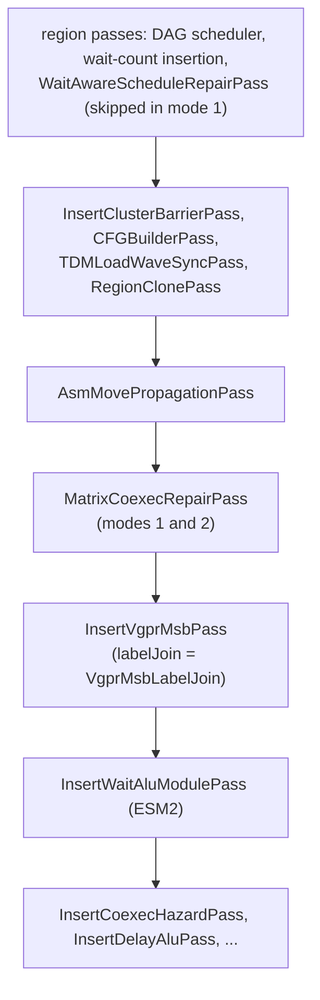
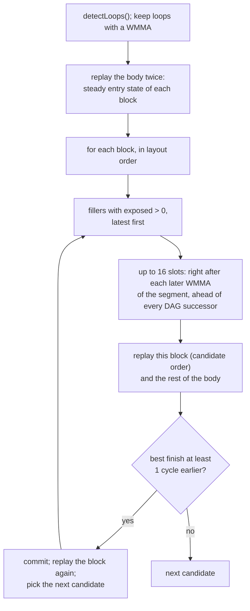

# Matrix Co-execution Repair Pass

## Status

This document describes the current implementation. The pass is experimental and
off by default (`StinkyTofuMatrixCoexecRepair = 0`): on the gfx1250 jichang GEMMs it has
not yet beaten the default pipeline on hardware (see Limitations).

`MatrixCoexecRepairPass` looks at the main loops of a gfx1250 kernel after the CFG is
final and before `InsertVgprMsbPass` / `InsertWaitAlu` run. It replays one wave's
in-order issue next to the matrix pipe and sinks a VALU or SALU "filler" whose stall
leaves the pipe idle to right after a later WMMA, where the stall overlaps queued matrix
work. A move is kept only when the replay predicts the loop body at least one cycle
shorter.

## Goals

The pass:

- never changes the relative order of anything but fillers: WMMAs, memory operations,
  counter waits, barriers, branches, labels and exec-mask groups form a fixed skeleton;
- moves a filler only later, only inside its segment, and never past a register
  consumer, a later writer of its registers, or a later writer of what it reads;
- charges the `s_set_vgpr_msb` and `s_wait_alu` instructions the later passes will
  insert, using the same walks those passes use;
- does nothing when the replay predicts no gain, so a loop bound by barriers or memory
  is left alone;
- reports what it predicted, per loop and per instruction, when asked to.

## Pipeline Position



The pass runs once per kernel on the entry function (`createMainOnlyAdaptor`). By then
the cluster-barrier diamonds and the cloned regions are in place, so the replay sees the
blocks that are emitted.

## Options

| Option | Tensile global parameter | Values |
|---|---|---|
| `ModuleOptions::MatrixCoexecRepair` | `StinkyTofuMatrixCoexecRepair` | `0` off (default): `WaitAwareScheduleRepairPass` runs; `1` repair: this pass replaces `WaitAwareScheduleRepairPass`; `2` analyze only: `WaitAwareScheduleRepairPass` runs and this pass only replays and reports |
| `ModuleOptions::VgprMsbLabelJoin` | `StinkyTofuVgprMsbLabelJoin` | `InsertVgprMsbPass` label-join rule (see below) |

With `StinkyTofuCostOutputDir` set, modes 1 and 2 write
`<dir>/<kernel file base>/matrix_coexec_repair.json`.

`stinkytofu-opt` accepts:

```text
--MatrixCoexecRepairPass[=analyzeOnly,predictWaitAlu,trackValuVsrc,report=<path>]
--InsertVgprMsbPass[=labelJoin]
```

`predictWaitAlu` / `trackValuVsrc` mirror what the backend sets from `EnableESM2` /
`EnableESM2TrackValuVsrc`; `--vgpr-msb-mode` selects the MSB form the replay charges.

## What The Pass Does

```text
  before                                  after
  ------                                  -----
  WMMA_0                                  WMMA_0
  s_mov   s5, 1                           s_mov   s5, 1
  v_add   v40, s5, v41   <- SALU->VALU    v_add   v40, s5, v41   (hidden by the backlog)
  s_mov   s6, 2              stall,       s_mov   s6, 2
  v_add   v42, s6, v43   <- pipe idle     s_mov   s8, 3
  s_mov   s8, 3                           WMMA_1
  v_add   v44, s8, v45   <- pipe idle     v_add   v42, s6, v43   <- stall under WMMA_1
  WMMA_1                                  WMMA_2
  WMMA_2                                  v_add   v44, s8, v45   <- stall under WMMA_2
  WMMA_3                                  WMMA_3
```

This is `tests/filecheck/matrix_coexec_repair_sink_test.stir`: the replay predicts the
iteration 56 -> 44 cycles. In `matrix_coexec_repair_noop_test.stir` the same `v_add`
stall sits behind four queued WMMAs, the pipe never idles, and nothing moves.

## The Replay: `CoexecSimulator`

`src/transforms/asm/coexec/CoexecSimulator.{hpp,cpp}` replays one basic block from a
`SimState` (copyable, so every candidate order starts from the same state):

- **Matrix pipe.** A WMMA issues when fewer than `queueCapacity` WMMAs are held; the
  pipe executes them one at a time for each one's `latencyCycles`.
- **Operands.** A read waits for its producer by producer / consumer class:
  SALU -> SALU 1, SALU -> VALU / matrix / memory `saluSgprToValu`, SALU SCC ->
  branch `sccToBranch`, VALU -> anything `valuVgprToValu`, WMMA -> non-matrix at the
  WMMA's execution end (WMMA -> WMMA accumulation is forwarded), DS -> at the DS
  return. Implicit SCC / VCC from the `IF_Implicit*` flags count. The cycle
  write-then-read rules of `HWModel::hazards` (e.g. `ValuVgprToVmemAddr`, 32 cycles) are
  minimum distances on top, so a move cannot undo a gap the DAG scheduler kept.
- **`s_set_vgpr_msb`.** `VgprMsbPlanner` places the switches exactly as
  `InsertVgprMsbPass` will. A switch costs `msbAfterMemOrWait` extra cycles after a DS,
  VMEM or `s_wait_*`, makes a VALU wait `msbAfterSaluBeforeValu` after a SALU, and is
  free after a VALU, a WMMA, or a SALU not followed by a VALU.
- **`s_wait_alu`.** With `predictWaitAlu`, `WaitAluTracker` (seeded with the last 128
  instructions of the loop body) predicts the waits `InsertWaitAlu` will insert.
  `va_vdst(N)` releases when all but `N` of the VGPR-writing VALU ops and matrix
  sub-issues have retired; the counter retires in order, a scaled WMMA (VOP3PX2/PX3)
  counts twice, and a WMMA retires `matrixVaVdstTailCycles` after its execution ends.
- **Counter waits.** `s_wait_dscnt N` and `s_barrier_wait` issue at once and hold the
  next instruction: until all but `N` DS ops have returned (a DS op returns at
  `max(issue + latency, previous return + dsReturnIntervalCycles)`), or until the
  signal's `Barrier::signalToWaitLatency`. An `s_wait_*` / `s_barrier_*` right after a
  WMMA issues `syncAfterMatrixCycles` after it. `s_wait_tensorcnt` / `loadcnt` /
  `kmcnt` do not stall.

Each instruction gets an `IssueRecord`: issue cycle, stall (cycles past the slot the
previous instruction left) and exposed (the part of the stall with the matrix pipe idle).

### `HWModel::MatrixIssue`

| Field | gfx1250 | Source |
|---|---|---|
| `queueCapacity` | 4 | ATT, MXF8 MAF loop |
| `wmmaIssueCycles` | 2 | ATT |
| `saluSgprToValu` | 10 | ATT (`s_cmov` -> VALU) |
| `valuVgprToValu` | 5 | ATT |
| `sccToBranch` | 9 | ATT (`s_cmp` -> `s_cbranch`) |
| `msbAfterMemOrWait` | 3 | ATT replay: DS / VMEM / wait -> switch -> X is 4 cycles |
| `msbAfterSaluBeforeValu` | 9 | ATT replay: 8.7-9.7 |
| `syncAfterMatrixCycles` | 8 | ATT replay: 7.6-10 |
| `matrixVaVdstTailCycles` | 16 | fit to the MXF4 `va_vdst` stalls |
| `dsReturnIntervalCycles` | 6 | fit to the `s_wait_dscnt` releases of both loops |

gfx1250v0 leaves the whole struct zero, which makes the pass a no-op there.

## Segments, Skeleton and Fillers

A *filler* is a VALU (non-transcendental) or SALU instruction with at least one
destination, all of them V / S / SCC / VCC registers, and no LDS pseudo-register. Every
other instruction is skeleton.

A segment ends at non-instruction IR, labels and other pseudo instructions, branches,
calls, barriers, exec-mask groups (`collapseExecMaskedRegions` brackets each block, as
in `WaitAwareScheduleRepairPass`), `IF_HasSideEffect` instructions, global stores and
atomics, and any existing `s_wait_alu` / `s_delay_alu` / `s_set_vgpr_msb`. Counter
waits are not boundaries: a filler reaches other instructions only through registers,
and `buildRegisterDependencyDAG` orders it against every reader and writer of those.

A segment that sits between an `s_barrier_signal` and the `s_barrier_wait` after it (a
barrier window) is never touched: when the wave gets there is set by the other waves.
On the MXF4 MAF loop, sinking the two LDS-address `v_xor_b32` of each window behind its
WMMAs was predicted 5 cycles shorter per stage and measured 0.7% slower, all of it as
`s_wait_tensorcnt` / barrier exposure.

## Search



- The objective is the finish (`max(next issue, matrix free)`) of the loop iteration
  from this block's steady entry state, so a move that delays a consumer in a later
  block is charged for it.
- A block makes at most four moves per filler it holds; every committed move strictly
  shortens the predicted iteration, so the search terminates.
- After a block is done, the next block's entry state is replayed from the new order.

## Report

`matrix_coexec_repair.json` (modes 1 and 2, or `report=<path>`):

```json
{
  "kernel": "...", "mode": "analyze" | "repair",
  "model": { "queueCapacity": 4, "...": 0 },
  "loops": [ {
    "header": "label_...",
    "iterationCycles": { "before": 3198, "after": 3181 },
    "blocks": [ {
      "label": "...",
      "before": { "finish": 0, "matrixIdle": 0, "instructions": [
        { "op": "v_add_co_u32", "issue": 0, "stall": 0, "exposed": 0,
          "msb": false, "waitAlu": false, "filler": true } ] },
      "after":  { "...": "same, repaired order" },
      "moves": [ { "op": "v_xor_b32", "from": 72, "to": 73, "gain": 2 } ]
    } ]
  } ]
}
```

`from` / `to` index the block's StinkyInstructions. With remarks enabled the pass also
prints one `LoopSummary` line per loop.

## InsertVgprMsbPass: Planner and Label Join

`VgprMsbPlanner` (`include/stinkytofu/transforms/asm/VgprMsbPlanner.hpp`) is the
switch-placement walk of `InsertVgprMsbPass` without the IR edits: feed it every
StinkyInstruction of a block and it returns each `PlannedMsbSwitch` (the instruction to
insert before, the immediate, whether an `s_nop 0` precedes it). The pass materializes
exactly these switches, and the replay costs them, so the two cannot drift.

With `labelJoin`, the pass recognizes the cluster-signal diamond

```text
  head:   ...; s_cmp_eq_u32 ...; s_cbranch_scc0 L
  middle: s_barrier_signal -3            (no label, branch, call or VGPR operand)
  L:      label; first VGPR instruction needs state S
```

laid out in that order, where only the head's branch names `L`. Both paths into `L`
leave the head's exit state, so the switch to `S` goes before the `s_cmp` (Msb16 packs
the head's state in bits [15:8], e.g. `0x828b`) and `L` starts in `S`: no `s_nop`, no
switch after the label. Anything else keeps today's per-label reset. The match uses the
block layout and the label references only, not CFG edges.

## Validating The Model

`analysis_repairMatrixCoexec/scripts/compare_sim_trace.py` aligns a mode-2 report with a
GEMM Analyzer loop timeline of the same kernel and reports the iteration error, per-TDM-
stage errors (also net of the hold after each `s_barrier_wait`, which is other waves
arriving), and how many measured holes of five cycles or more the replay predicts as a
stall and as exposed matrix idle.

## Limitations

- Mode 1 drops `WaitAwareScheduleRepairPass`, which is worth about 0.25% on the MXF4 MAF
  loop and 0.35% on BBS MAB; the replay does not see that gain, so mode 1 starts behind.
- One wave: other waves are invisible, so barrier waits are underpredicted and a loop
  bound by them (MXF8 MAF) looks shorter than it is.
- The matrix queue occupancy is the weakest part of the model: on MXF4 the replay finds
  most hole sites as stalls but often still has queued WMMAs there, so it predicts
  them hidden.
- `s_wait_tensorcnt` / `loadcnt` / `kmcnt` are free; taken branches cost nothing extra.
- Only sinks: a filler never moves earlier, and nothing hoists a producer.

## Implementation Layout

```text
include/stinkytofu/transforms/asm/MatrixCoexecRepairPass.hpp
include/stinkytofu/transforms/asm/VgprMsbPlanner.hpp
include/stinkytofu/hardware/HWModel.hpp              (HWModel::MatrixIssue)
src/transforms/asm/MatrixCoexecRepairPass.cpp
src/transforms/asm/coexec/CoexecSimulator.{hpp,cpp}
src/transforms/asm/VgprMsbPlanner.cpp
src/transforms/asm/InsertVgprMsbPass.cpp             (planner + label join)
src/pipeline/backend/Gfx1250Backend.cpp              (wiring)
```

## Tests

```text
tests/unit/asm/CoexecSimulatorTest.cpp
tests/unit/asm/MatrixCoexecRepairPassTest.cpp
tests/unit/asm/VgprMsbPlannerTest.cpp
tests/unit/asm/HWModelTest.cpp                       (MatrixIssue values)
tests/filecheck/matrix_coexec_repair_{sink,vcc_pair,boundary,noop}_test.stir
tests/filecheck/insert_vgpr_msb_label_join{,_negative}.stir
tests/filecheck/insert_vgpr_msb_wait_tensorcnt_anchor.stir
```
