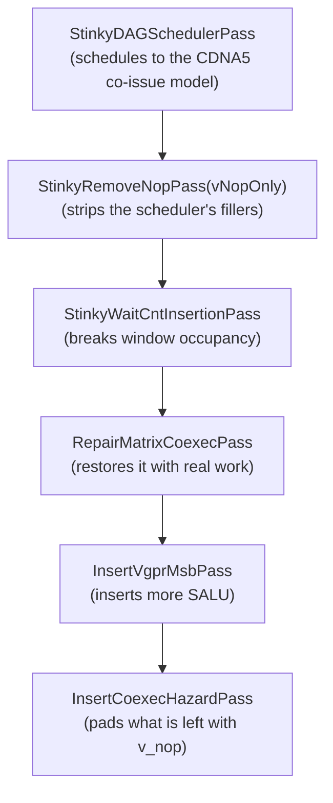

# Repair Matrix Co-Issue Pass

## Status

Shipped. `RepairMatrixCoexecPass` is the repair pass the gfx1250 backend runs, gated on the scheduler having run at all. It was built alongside the earlier `WaitAwareScheduleRepairPass` so the two could be compared on real kernels; that pass, its `WaitAnchoredReadyQueue`, the `WaitRepairSlotsToMovePastAnchor` option and the tests encoding the count budget have since been deleted.

Building it separately is what made the comparison possible. The two passes disagreed about what a window target *is* — a count relative to the input versus the hardware's own capacity — so no toggle inside one pass could express both without keeping two policies alive in the same object.

Wait anchors, segments and the wait-immutability contract carried over from the old pass and are described below. The window budget, the carry ledger and the DS gap rule did not: the DS gap rule in particular turned out to be inert on production IR, where 214 of 218 DS loads already sit adjacent to the matrix op ahead of them, and re-stating it here would have reintroduced the second rule set this design exists to remove.

The name drops "wait" deliberately: waits are the most common reason co-issue gets broken, not the thing being repaired.

## The premise, and what measurement says about it

`StinkyDAGSchedulerPass` schedules against a hardware co-issue model (`CDNA5.hpp`). Later passes insert instructions — final waits above all — and those insertions can break the arrangement the scheduler built. A repair pass is therefore needed.

Today that repair works from a proxy: it counts how many non-WMMA instructions sat between two matrix ops in its *input*, and moves a fixed number of them past each anchor. Nothing in it refers to the hardware rules. The proposal is to use those rules directly.

Before designing that, the rules were measured on a production gfx1250 GEMM kernel (2485 instructions, 384 `v_wmma_scale_f32_16x16x128_f8f6f4`, `.cost = {1, 8}`, `.coissue = 0x00C8`). The result reframes the work, so it comes first.

| | windows | back-to-back WMMA | empty windows | under-filled | issue-cycle coverage |
|---|---|---|---|---|---|
| input to the repair | 383 | 150 | 150 | 380 | 590/3064 = 19% |
| repair disabled | 383 | 150 | 150 | 380 | 19% |
| repair enabled | 383 | 150 | 150 | 381 | 19% |

Three things follow.

**The current repair changes none of the co-issue properties it exists to protect.** Every column is identical with it on and off. It is not that the pass is subtly wrong; on this kernel it is inert with respect to co-issue.

**150 of 383 windows have two matrix ops adjacent with nothing in between.** That directly violates the scheduler's own rule that a WMMA is held while any non-WMMA work is pickable. This is the real defect, and it is the one worth targeting.

**Co-issue *slot* occupancy cannot be improved on this kernel at all.** Each WMMA offers `popcount(0x00C8) = 3` slots, so the region demands 1152, but only 42 VALU-pipe instructions exist anywhere inside it. Measured occupancy is 42/1152, which means every available VALU op is already inside a window. No reordering pass can do better, and `InsertCoexecHazardPass` confirms the hazard side is clean: it inserts zero `v_nop`s either way.

So the redesign should target window *occupancy*, which is pipe-agnostic and has slack, and not co-issue *slot filling*, which is pipe-specific and already saturated.

## What the hardware rules actually are

`CDNA5ReadyQueue::pickOne` holds a ready WMMA back for five reasons. Naming them is most of the design, because the repair should restore the same ones.

| gate | rule | what counts as a fill |
|---|---|---|
| `blockWmmaForActiveWindow` | the previous window is still open and some non-WMMA is pickable | any instruction |
| `blockWmmaForAtLeastOneNonWmmaInterleaving` | never two WMMAs adjacent while non-WMMA work is pickable | any instruction |
| `blockWmmaForCoexecSpacing` | a *dependent* WMMA needs `popcount(coIssueWindow) + 1` fills behind its producer | VALU-pipe only |
| `blockWmmaForHideBudget` | the policy budget from `RegionHideBudget` | any instruction |
| `blockWmmaForLoopHeadBalance` | loop-head deferral heuristic | any instruction |

The distinction in the last column is the one the current pass misses, and it cuts both ways. Two of these rules are satisfied by *any* instruction occupying an issue cycle in the matrix op's latency shadow. Only the coexec-spacing rule requires VALU-pipe ops specifically, and only between a producer and a register-dependent consumer.

The per-instruction facts needed to evaluate any of this are already on the instruction, as static per-opcode metadata from the ISA tables:

- `inst.latencyCycles` — the window length.
- `inst.issueCycles` — what one instruction consumes of it.
- `inst.coIssueWindow` — bitmask of cycles that accept a co-issued VALU.
- `inst.getHwInstDesc()->blockedScaleMask` — cycles the hardware occupies outright.

No scheduler state is required to read them, which is what makes a rule-based repair feasible at all.

## What already exists

Three pieces of this are built, and the redesign should consume rather than duplicate them.

**`isBlockedWindowCycle`** in `WmmaHideBudgetAnalysis.hpp` is already the shared answer to "can anything issue at this cycle of the window", used by the scheduler's `advanceTime`, `computeValuAdvanceCycles` and `freeCoexecSpace`. It is a free function in an analysis header precisely so non-scheduler code can ask.

**`analyzeWmmaHideBudget`** produces a `RegionHideBudget`: a per-window count of non-WMMA instructions that the *scheduling policy* assigns, independent of any input IR. This is already the policy-derived budget the proposal asks for, and `CDNA5ReadyQueue` drives `blockWmmaForHideBudget` from it.

**`InsertCoexecHazardPass`** runs later in the pipeline, on final IR, and already enforces the coexec-spacing rule for real: it scans backward from each hazard-relevant consumer, counts existing slot fillers, and tops the shortfall up with `v_nop`s. Correctness of the VALU-only rule is therefore not the repair's job, and should not become it.

That last point sets the repair's objective precisely. The hazard pass guarantees spacing; what it cannot do is make the spacing *useful*, because a `v_nop` hides nothing. The repair's job is to supply real work where real work exists, so the hazard pass has less to pad.

Pipeline order, which makes this composition work:



## The redesign

### Objective

Where the existing pass moves `kSlotsToMovePastAnchor` instructions past each anchor, the new pass works to an explicit, measurable target per window, evaluated in priority order:

1. **No matrix op is adjacent to another** while any movable non-WMMA instruction remains. This is the scheduler's interleaving rule, and the measurement above says it is violated 150 times.
2. **Each window is filled toward its own latency**, counted in `issueCycles` and skipping cycles `isBlockedWindowCycle` reserves. This is the active-window rule. It will usually remain unmet — see the limits below — but it gives a direction and a stopping condition instead of a fixed count.
3. **Dependent matrix pairs get VALU-pipe fills** where independent VALU work is available, which is the only rule that is pipe-specific. Anything still short is left to `InsertCoexecHazardPass`.

Objective 1 is the one with headroom. Objective 2 is the limit function. Objective 3 is opportunistic.

### Reuse the ready queue, do not restate the rules

The new pass should not reimplement the rules. It should *execute* them through the same object the scheduler uses, so that a future rule change, or a new arch, lands in one place and the pass inherits it. That is feasible, and more cheaply than it first appears.

`ReadyQueue` is already a small polymorphic oracle — `pickOne`, `push`, `empty`, the `onInit` / `onInitRegion` / `onFinishBB` lifecycle, and `takePendingFillerInsts` — and `scheduleRegionWithMovableSideEffects` is already generic over it. `CDNA5ReadyQueue` is one implementation; the old repair's `WaitAnchoredReadyQueue` was another. So the two passes never differed in their driver, only in which queue they handed it and what they prepared first.

What the scheduler does before driving the queue is a fixed sequence, all of it in `StinkyDAGSchedulerPass.cpp`:

```text
buildRegisterDependencyDAG(regionStart, regionEnd)
applyClusterBarrierSccRule(...)          // SCC chain edges
dsReadPriority pre-scan                  // DS affinity ordering
requiredMsb pre-scan                     // s_set_vgpr_msb banks
hazardFlags / hazardDeadline pre-scan    // consumer gates, producer hoisting
readyQueue.onInitRegion(...)             // prefix latency seeding, loop state
  -> generic Kahn loop
```

Every one of those populates `DAGNode` fields that `CDNA5ReadyQueue` then reads. None of it is scheduler-specific policy; it is the preparation the queue's contract requires. So the refactor is an extraction, not a rewrite:

1. Lift the block above into a shared `prepareRegionForScheduling()` that returns a `RegionDAG` with every node field populated and the queue initialised.
2. Lift the Kahn loop into a shared `drainReadyQueue()`. Both passes already have one; the scheduler's additionally drains `takePendingFillerInsts()`, which is the version to keep.
3. `RepairMatrixCoexecPass` is then thin: discover wait anchors, split segments, `prepareRegionForScheduling`, add its own edges, `drainReadyQueue` with a `CDNA5ReadyQueue`, re-emit waits before their anchors. It shares the anchor discovery and segment splitting with the existing pass, so that part is lifted rather than copied.

### What that deletes

The new pass needs none of the existing pass's policy, because all of it was approximating what the real queue already does. This is the list that gets deleted when the old pass is retired:

| today | under reuse |
|---|---|
| `kSlotsToMovePastAnchor` count budget | the queue's own window, hide budget and co-issue gates |
| `kPreserveMatrixToDsGap` release distances | `CDNA5ReadyQueue`'s DS cap, throttle and in-flight model |
| mandatory-producer rule in the pick policy | counter-order edges, which the repair already builds |
| `WaitAnchoredPickPolicy`, `WindowState`, carry ledger | nothing; the queue carries its own timeline |

What survives is exactly the part that is about the repair's *constraints* rather than the hardware's rules, and all of it is already expressed as DAG edges or as segment boundaries:

- **Counter-order edges.** Still required, and now load-bearing: they are what keeps a wait immediate meaning the same thing when the queue is free to reorder around it.
- **The attached wait's issue cycle.** A wait is kept out of the DAG but re-emitted in front of its anchor, where it still costs a cycle. `DAGNode::preIssueCycles` tells the queue about it so the window stops one cycle short instead of letting the wait push the anchor past the close. Measured in *free* shadow, not window position: the timeline skips blocked cycles, so a position-based reservation is silently absorbed by the `LD_SCALE` cycle and changes nothing.
- **Letting a full window end the fill.** `ArchReadyQueueOptions::fullWindowOverridesHideBudget`. The region's latency-hiding quota does not clear when a window closes, so on its own it keeps stuffing a window that is already full. The repair's input already satisfies that quota, so for this caller the window is the authority. Needed together with the reservation above — each is inert without the other.
- **Skeleton-order edges.** Added after measurement, not designed in: memory operations and matrix instructions hold their scheduled order against each other, so only ALU work floats. The counter chain alone pins a memory op against the waits that count it, which is strictly weaker — a DS read is free to cross a matrix op that carries no `dscnt`, and on the production kernel 267 of 462 of them did. See the validation section for what that cost.
- **Prefetch hints.** Held by the skeleton chain in both directions, because no co-issue rule mentions them and the queue does not put a free hint back where the scheduler did: the scheduler placed it against the stage barrier and `tensor_load` of its whole region, which a segment rarely contains. Left free, hints moved by up to 244 matrix ops on the gfx1250 tile kernels. The VALUs computing a prefetch's address are not held; they are ALU work like any other.
- **Segment boundaries and exec-mask bracketing.** Unchanged.
- **Wait re-emission.** Unchanged: waits stay out of the DAG and go back immediately before their anchor.

### Why this is safe to drive on post-waitcnt IR

Two properties make it work, and the second was worth checking rather than assuming.

The queue never sees the waits. The repair already removes them from the schedulable set and re-emits them, so the queue schedules the same kind of instruction stream the scheduler gave it, not a wait-laden one.

**The scheduler is idempotent on its own output.** Re-running `StinkyDAGSchedulerPass` over an already-scheduled region reproduces it byte for byte, on all 44 filecheck inputs containing matrix ops. That is the property this design depends on: if re-scheduling churned, a repair built from the same queue would move code for no reason every time it ran. Because it is a fixed point, the repair only moves what the new constraints — the waits — actually force.

### The honest cost

This stops being a local fixup and becomes a re-schedule under added constraints. Three consequences to accept deliberately.

**The object-count invariant goes.** `takePendingFillerInsts()` exists so the queue can emit `v_nop` spacers, and honouring it means the new pass may add instructions. That is acceptable, and arguably correct: `InsertCoexecHazardPass` would insert the same spacers later anyway, and it runs after the repair, so a spacer the queue places is one the hazard pass does not have to.

**The blast radius is a segment, not a slot.** The old pass provably moved at most `kSlotsToMovePastAnchor` instructions per anchor. This one may reorder a segment arbitrarily, within dependencies. The protection is no longer a small budget but the edge set plus idempotence, which is a weaker guarantee and needs the validation below to hold it. The skeleton edges narrow it considerably after the fact: with memory and matrix order frozen, the only thing a segment replay can actually reposition is ALU work.

**The queue's heuristics were tuned on pre-waitcnt IR.** `CDNA5ReadyQueue` carries cross-BB and loop state, and seeds DS latency from the block prefix. Driven from the new pass that prefix is a different instruction stream. It should still be correct, but it is tuning drift, and it is the most likely source of surprises.

### What does not change

The wait contract is untouched: the same objects with the same immediates and modifiers, each still emitted immediately before its original anchor, and still kept out of the DAG while scheduling. Segment boundaries and exec-mask bracketing are unchanged. Counter-order edges survive, and so does holding prefetch hints in place, now done by the skeleton chain. Both matter more than before, because the queue is otherwise free to reorder the segment.

What does change, and is listed under the honest cost above: the count budget, the DS gap rule and the mandatory-producer rule all go, and the pass may add queue-emitted `v_nop` spacers rather than strictly preserving the IR object count.

## Limits worth stating up front

The measurement sets a hard ceiling on what this can achieve, and the design should not be sold past it.

Inside the WMMA region there are 590 non-matrix instructions for 383 windows, against 3064 cycles of exposed latency. Of those 590, roughly 394 are DS loads and 12 are VMEM, which the mandatory-producer rule forbids from crossing an anchor, and 47 are waits, which are pinned by definition. That leaves on the order of 137 freely movable instructions against 150 empty windows.

So even a perfect redistribution closes most of the interleaving violations and no more, and issue-cycle coverage stays near 19% because the work to raise it does not exist in the region. The honest framing of the expected gain is "most of 150 back-to-back matrix pairs become interleaved", not "windows become full".

If coverage rather than interleaving is the goal, the lever is not this pass. It is either giving the scheduler more to interleave — software pipelining depth, unroll factor — or accepting that a DS-load-bound main loop exposes matrix latency by construction.

## How it was staged

Steps 1 to 3 were refactors and tests with no behaviour change. Step 5 changed generated code; step 7 removed the old pass.

1. Extracted `prepareRegionForScheduling()` and `drainReadyQueue()` into `dag/RegionScheduling.{hpp,cpp}`, and `chooseReadyQueue` into `dag/ArchReadyQueue.cpp` as an exported `createArchReadyQueue()`, which is now the only translation unit including `CDNA5.hpp`. Output stayed byte-identical across the suite.
2. Lifted wait-anchor discovery, segment splitting and the synthetic-edge builders into `dag/WaitAnchors.hpp`.
3. Added the occupancy metrics as a `PASS_DEBUG` dump plus an idempotence test asserting that scheduling an already-scheduled region is a fixed point.
4. Added `RepairMatrixCoexecPass`, registered in `stinkytofu-opt` but not yet in the backend.
5. Switched the gfx1250 backend to it, gated on `runScheduler`.
6. Measured on the production kernel.
7. Deleted `WaitAwareScheduleRepairPass`, `WaitAnchoredReadyQueue`, `WaitAnchoredPickPolicy`, `kSlotsToMovePastAnchor`, `kPreserveMatrixToDsGap`, the `WaitRepairSlotsToMovePastAnchor` option and the tests encoding the count budget. The prefetch requirement stayed: it had already moved into the shared `dag/WaitAnchors.hpp` at step 2 and both passes relied on it, so it outlived the pass, with its test `repair_matrix_coexec_prefetch_pin_test.stir`. The skeleton chain now enforces it.

Steps 1 and 2 were worth doing on their own merits: the Kahn loop had been duplicated between the two passes, and both the pre-scan block and anchor discovery were reachable only from inside one translation unit each.

### What step 5 cost

One thing only surfaced once the pass ran in the real pipeline. `prepareRegionForScheduling` walks `getUsers()` to find each hazard's nearest consumer, and the chains the scheduler builds insert PHI pseudo-instructions that `StinkyWaitCntInsertionPass` later erases *without* unlinking them. Every chain reaching a pass that runs after waitcnt insertion can therefore name freed memory. The scheduler never noticed because it builds the chains itself; this pass, running later, read them and crashed on the PHI opcode test.

So the pass rebuilds the chains on entry and calls `discardDefUseAnalysis()` on exit, which clears chains before removing PHIs and hands the IR back in the shape it arrived. The dangling-chain hazard in `removePHIs()` is still there for the next late pass that reads `getUsers()`.

Worth recording that `stinkytofu-opt` could not have found this: there the chains are either empty or freshly built, never stale. Any pass reusing `prepareRegionForScheduling` from late in the pipeline needs the same treatment.

## Validation

While both passes existed, every comparison was a direct A/B on the same input rather than a before-and-after across a commit.

The metrics are the ones measured above, turned into a dump by step 3:

- back-to-back matrix pairs, and empty windows — the objective with headroom, currently 150 of 383;
- issue-cycle coverage: `issueCycles` placed in each window against the window cycles the matrix op exposes, excluding the ones `isBlockedWindowCycle` reserves — currently 19%, and bounded by available work;
- VALU-pipe slot occupancy against `popcount(coIssueWindow)` per window — currently 42/1152 and already saturated;
- `v_nop`s emitted by the queue plus those inserted downstream by `InsertCoexecHazardPass` — their sum should not rise.

The bar for step 5 was that the new pass strictly improves back-to-back pairs and empty windows, and regresses none of the others.

It did not clear that bar on the first attempt, and finding out why is what produced the skeleton rule. Replaying a segment with only the counter and pin edges in place bought 187 of 762 issue cycles to 190, but took empty windows from 50 to 53 — a regression on the primary metric — and got there by moving 267 of 462 DS reads across a matrix op while moving only 20 of 818 VALU ops. Nearly all of the movement, and all of the apparent gain, came from re-scheduling LDS reads rather than from refilling windows.

With `addMatrixMemoryOrderEdges` holding the skeleton, no DS read and no matrix op changes position relative to a matrix op, the useful VALU moves survive, and empty windows hold at 50 instead of regressing.

Then the per-window accounting. Counting instructions between consecutive matrix ops against the 6 issuable cycles a `v_wmma_scale_f32_16x16x128_f8f6f4` exposes, `label_LoopBeginL` arrives with 5 over-subscribed windows and 6 overflow cycles. Five of those six cycles are the attached waits, which the queue was never told about. Fixing that alone does nothing, because the hide budget keeps filling past the window close anyway; fixing that alone does nothing either, because the queue still fills to the last cycle and the wait still pushes past it. Together they take the block to 2 over-subscribed windows and 3 overflow cycles, with empty windows still at 50 and issue cycles at 189-191 against 187-188 on input.

That is the honest size of the win: half the over-subscription, two or three issue cycles, and no regression anywhere. VALU slot occupancy stays pinned near 14 of 381 because only 14 non-matrix VALU ops exist in the region to place. The ceiling is available work, not scheduling, which is the same conclusion the measurement section reaches above.

The useful consequence is that the pass is now cheap to reason about. It cannot move memory, it cannot reorder matrix ops, and it cannot touch a wait immediate, so the worst it can do is reposition ALU work inside a segment.

Because the new pass reorders a whole segment rather than a bounded number of slots, the invariants carry more weight than the metrics and should be asserted rather than measured:

- every wait immediately before its original anchor, with its immediate and modifiers untouched;
- no instruction crossing a segment boundary or an exec-mask group;
- every original IR object present exactly once; the queue's `v_nop` spacers are dropped rather than spliced, because this pass runs inside a region adaptor and may only emit IR the block already owns. `InsertCoexecHazardPass` runs later over final IR and supplies the same spacing from the pass that owns inserting it;
- prefetch positions still matching, which is what survives of the DS-gap/prefetch pair now that the gap rule is gone;
- running the pass twice changes nothing the second time.

That last one is only true with the CFG built. Run through `stinkytofu-opt` without `--CFGBuilderPass`, the whole function collapses into one block, the prologue is swept into a matrix-anchored segment and the pass churns it on every application. The fixed-point test must therefore build the CFG first, as the pipeline does.

## Why the arch queue, and not one of our own

Reuse was questioned once the accommodations added up: a queue option to make a
full window outrank the region's hide budget, a `DAGNode` field for the anchor
wait's issue cycle, skeleton-order edges to stop the DS model rearranging memory,
and a def-use chain rebuild to feed pre-scans this pass never reads. A
purpose-built queue over the window model alone would be some sixty lines against
`CDNA5ReadyQueue`'s 2852, and far easier to state the limits of.

Measurement argued the other way, twice.

The defects it was meant to fix are not policy. Clumping five VALU ops into a
three-slot window, and the overflow cycles that come with it, happen because the
trace shows those ops arriving through the queue's progress fallback as *DAG
predecessors of the next matrix op* -- they have to issue before it. Two targeted
fixes were built against this (ranking slot-spent VALU last, then treating it as
nothing to interleave) and both measured inert. Any queue faces the same
dependency.

And the hazard gate is correctness with no backstop. Both rules in
`kCdna5HazardRules` have ALU producers, ALU is exactly what this pass moves, and
`Gfx1250HazardPass` is registered in `stinkytofu-opt` but is not in the gfx1250
pipeline. `CDNA5ReadyQueue::hazardGates_` is unconditional regardless of
scheduling order; reimplementing it is about fifteen lines reactively, but a
mistake there is a miscompile rather than a slow kernel.

What survived the question is the part that stands on its own:
`CoexecWindow` now holds the window timeline -- the masks, the latency, the cycles
the hardware reserves -- and `CDNA5ReadyQueue` uses it rather than its own copy,
verified byte-identical across the suite. The model is shareable whoever ends up
asking.

The name follows the AMDGPU backend, which calls this co-execution
(`GCNHazardRecognizer::fixWMMACoexecutionHazards`) and reserves co-issue for
whether two instructions share an issue slot (`SIInstrInfo::isNeverCoissue`, next
to the VOPD dual-issue pass). Older names here, including the `coIssueWindow` ISA
field, predate the distinction.

## Open questions

**Does the repair still need its own segment model?** `CDNA5ReadyQueue` has its own notion of regions and reacts to barriers and cluster-barrier rules. The repair splits segments on side effects and exec groups. These two have to be reconciled, and it is the part of the design with the least evidence behind it.

**Should a wait count toward window occupancy?** Settled: yes, and it does now, via `DAGNode::preIssueCycles`. The original argument for leaving it out was that a wait which stalls hides nothing, so counting it would let a window be declared full by the instruction that broke it. That confuses two things. The issue cycle is spent whether or not the wait stalls, and the wait sits immediately before the anchor, so it delays the next matrix op either way; a wait that *also* stalls is a separate and larger problem. Measurement settled it: five of the six overflow cycles on the production kernel's main loop were this one unmodelled cycle. The wait still stays out of the DAG, so the contract is unchanged — only its cost is now visible to the queue.

**How should `InsertVgprMsbPass` be handled?** It inserts SALU after this pass, perturbing occupancy the repair just restored. Either it moves before the repair, or the repair leaves headroom, or occupancy is measured after it rather than here.

**Is one arch queue enough?** The premise of reuse is that a new rule set arrives as a new `ReadyQueue` subclass. That holds for the gates and the timeline, but the repair also needs the pre-scans, which currently live in the scheduler pass rather than behind the queue interface. If a future arch needs different pre-scans, `prepareRegionForScheduling` is where that asymmetry will show up first.
